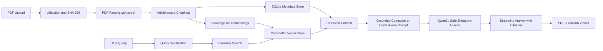

# adala ai

A production-grade Retrieval-Augmented Generation platform for Egyptian legal research. Users upload Egyptian law books, legal PDFs, constitutions, regulations, court rulings, and case files, then ask Arabic, English, or mixed-language questions. Answers are generated only from retrieved document chunks and include clickable source citations.

## Features

- PDF upload, validation, parsing, chunking, embedding, and indexing.
- `BAAI/bge-m3` Hugging Face embeddings with persistent ChromaDB storage.
- Qwen3 generation through Ollama or Transformers with a streaming FastAPI endpoint.
- Chatbot-style general conversation plus strict context-only legal answers with a deterministic not-found fallback.
- Arabic, English, and mixed Arabic-English queries.
- Streaming answer UI with visible research stages.
- Source metadata for document name, page, article number, chunk ID, and original text.
- Clickable citations that open the original PDF, jump to the cited page, and highlight relevant text.
- PDF.js viewer with page navigation, page search, deep links, and highlight overlays.
- Docker Compose and Hugging Face Spaces deployment paths.

## Architecture



## Folder Structure

```text
.
├── apps
│   ├── api
│   │   ├── app
│   │   │   ├── api              # FastAPI routes and SSE events
│   │   │   ├── rag              # Embeddings, Chroma, ingestion, prompts, Qwen streaming
│   │   │   ├── config.py        # Environment settings
│   │   │   ├── db.py            # SQLite metadata store
│   │   │   ├── main.py          # FastAPI app
│   │   │   ├── models.py        # Pydantic schemas
│   │   │   └── security.py      # Upload and query validation
│   │   ├── Dockerfile
│   │   ├── requirements-local.txt
│   │   └── requirements.txt
│   └── web
│       ├── app                  # Next.js App Router
│       ├── components           # Research workspace, PDF viewer, shadcn-style UI
│       ├── lib                  # API client, types, utilities
│       ├── Dockerfile
│       └── package.json
├── deploy
│   └── huggingface              # Single-container Space deployment
├── docker-compose.yml
└── README.md
```

## RAG Pipeline

1. Uploads are restricted to PDFs and validated by extension, MIME type, and `%PDF-` file signature.
2. The backend computes a SHA-256 hash to prevent duplicate indexing.
3. `pypdf` extracts text page by page.
4. The ingestion pipeline detects Arabic and English article markers such as `المادة 33` and `Article 33`.
5. LangChain splits each page into overlapping chunks while preserving page and article metadata.
6. `BAAI/bge-m3` creates normalized embeddings.
7. ChromaDB stores vectors, while SQLite stores document, chunk, conversation, and message metadata.
8. Queries are embedded and matched against ChromaDB.
9. Retrieved chunks are passed to the grounded answer composer by default. Optional Qwen3 synthesis can be enabled with `RAG_LLM_ENABLED=true`.
10. If no evidence is found, the API returns: `I could not locate this information in the uploaded legal documents.`

## API Routes

- `GET /api/health`
- `GET /api/documents`
- `GET /api/documents/search?q=...`
- `POST /api/documents/upload`
- `GET /api/documents/{document_id}`
- `GET /api/documents/{document_id}/file`
- `GET /api/documents/{document_id}/chunks/{chunk_id}`
- `POST /api/chat` using Server-Sent Events
- `GET /api/conversations`
- `GET /api/conversations/{conversation_id}/messages`

## Local Development

Local development uses `VECTOR_BACKEND=local` for fast lexical/article-aware retrieval and `LLM_PROVIDER=ollama` for chatbot-style responses. Legal RAG answers default to the safer grounded composer with `RAG_LLM_ENABLED=false`, which prevents the local model from adding unsupported legal facts. Set `RAG_LLM_ENABLED=true` only if you want experimental Qwen synthesis over retrieved context.

Install Ollama and pull a Qwen3 model for local chat generation:

```bash
ollama pull qwen3:1.7b
```

```bash
cp .env.example .env
npm install
```

Backend:

```bash
cd apps/api
python -m venv .venv
source .venv/bin/activate
pip install -r requirements-local.txt
uvicorn app.main:app --reload --host 0.0.0.0 --port 8001
```

Windows PowerShell:

```powershell
cd apps/api
py -m venv .venv
.\.venv\Scripts\Activate.ps1
pip install -r requirements-local.txt
uvicorn app.main:app --reload --host 0.0.0.0 --port 8001
```

Frontend:

```bash
npm run dev:web
```

Open [http://localhost:3000](http://localhost:3000).

## Docker

```bash
cp .env.example .env
docker compose up --build
```

The web app runs on [http://localhost:3000](http://localhost:3000), and the API runs on [http://localhost:8000](http://localhost:8000) inside Docker. Local non-Docker development uses API port `8001` to avoid conflicts with other services.

## Hugging Face Spaces

Create a Docker Space and use `deploy/huggingface/Dockerfile`. The container starts FastAPI on port `8000` and Next.js on the Space port `7860`; Next.js proxies `/api/*` to the internal API service.

Recommended variables:

```bash
DATA_DIR=/data
MAX_UPLOAD_MB=80
EMBEDDING_MODEL=BAAI/bge-m3
QWEN_MODEL_ID=Qwen/Qwen3-4B-Instruct-2507
OLLAMA_BASE_URL=http://localhost:11434
OLLAMA_MODEL=qwen3:1.7b
VECTOR_BACKEND=chroma
LLM_PROVIDER=transformers
RAG_LLM_ENABLED=true
TOP_K=6
MIN_RELEVANCE=0.25
NEXT_PUBLIC_API_BASE_URL=/api
INTERNAL_API_BASE_URL=http://127.0.0.1:8000
```

Use persistent storage for `/data` so PDFs, SQLite metadata, and Chroma indexes survive restarts.

## Screenshots

Add screenshots after first run:

- Main research workspace
- Streaming reasoning stages
- Clickable citations
- PDF.js citation viewer with highlighted retrieved paragraph

## Security Notes

- Only PDFs are accepted.
- Uploads are size-limited.
- Filenames are sanitized.
- User queries are stripped of control characters.
- Retrieved document text is treated as untrusted evidence, not as instructions.
- The model prompt forbids outside knowledge and mandates the exact not-found response when context is insufficient.

## Future Improvements

- Stronger OCR post-correction for historical Arabic PDFs.
- Hybrid BM25 plus vector retrieval.
- Cross-encoder reranking for long legal books.
- Role-based access control and per-matter workspaces.
- Redlining and memo export to DOCX/PDF.
- Citation confidence thresholds per legal domain.
