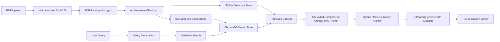

# adala ai

A production-grade Retrieval-Augmented Generation platform for Egyptian legal research. Users upload Egyptian law books, legal PDFs, constitutions, regulations, court rulings, and case files, then ask Arabic, English, or mixed-language questions. Answers are generated only from retrieved document chunks and include clickable source citations.


## Features

- PDF upload, validation, parsing, chunking, embedding, and indexing.
- `BAAI/bge-m3` Hugging Face embeddings with persistent ChromaDB storage.
- Qwen3 generation through Ollama or Transformers with a streaming FastAPI endpoint.
- Chatbot-style general conversation plus strict context-only legal answers with a deterministic not-found fallback.
- Arabic, English, and mixed Arabic-English queries.
- Streaming answer UI with visible research stages.
- Source metadata for document name, page, article number, chunk ID, and original text.
- Clickable citations that open the original PDF, jump to the cited page, and highlight relevant text.
- PDF.js viewer with page navigation, page search, deep links, and highlight overlays.
- Electron desktop shell for a compact installable app experience.
- Docker Compose and Hugging Face Spaces deployment paths.

## Architecture



## Folder Structure

```text
.
├── apps
│   ├── api
│   │   ├── app
│   │   │   ├── api              # FastAPI routes and SSE events
│   │   │   ├── rag              # Embeddings, Chroma, ingestion, prompts, Qwen streaming
│   │   │   ├── config.py        # Environment settings
│   │   │   ├── db.py            # SQLite metadata store
│   │   │   ├── main.py          # FastAPI app
│   │   │   ├── models.py        # Pydantic schemas
│   │   │   └── security.py      # Upload and query validation
│   │   ├── Dockerfile
│   │   ├── requirements-local.txt
│   │   └── requirements.txt
│   ├── web
│       ├── app                  # Next.js App Router
│       ├── components           # Research workspace, PDF viewer, shadcn-style UI
│       ├── lib                  # API client, types, utilities
│       ├── Dockerfile
│       └── package.json
│   └── desktop
│       ├── main.cjs             # Electron shell that starts API and UI
│       ├── package.json         # Windows installer config
│       └── settings.example.json
├── deploy
│   └── huggingface              # Single-container Space deployment
├── docker-compose.yml
└── README.md
```

## RAG Pipeline

1. Uploads are restricted to PDFs and validated by extension, MIME type, and `%PDF-` file signature.
2. The backend computes a SHA-256 hash to prevent duplicate indexing.
3. `pypdf` extracts text page by page.
4. The ingestion pipeline detects Arabic and English article markers such as `المادة 33` and `Article 33`.
5. LangChain splits each page into overlapping chunks while preserving page and article metadata.
6. `BAAI/bge-m3` creates normalized embeddings.
7. ChromaDB stores vectors, while SQLite stores document, chunk, conversation, and message metadata.
8. Queries are embedded and matched against ChromaDB.
9. Retrieved chunks are passed to the grounded answer composer by default. Optional Qwen3 synthesis can be enabled with `RAG_LLM_ENABLED=true`.
10. If no evidence is found, the API returns: `I could not locate this information in the uploaded legal documents.`

## API Routes

- `GET /api/health`
- `GET /api/documents`
- `GET /api/documents/search?q=...`
- `POST /api/documents/upload`
- `GET /api/documents/{document_id}`
- `GET /api/documents/{document_id}/file`
- `GET /api/documents/{document_id}/chunks/{chunk_id}`
- `POST /api/chat` using Server-Sent Events
- `GET /api/conversations`
- `GET /api/conversations/{conversation_id}/messages`

## Install and Run

Local development uses:

- FastAPI backend on [http://localhost:8001](http://localhost:8001)
- Next.js frontend on [http://localhost:3001](http://localhost:3001)
- Ollama/Qwen3 for normal chatbot responses
- A safer grounded composer for legal RAG answers by default

Legal answers are intentionally conservative with `RAG_LLM_ENABLED=false`, so the local model can chat naturally without adding unsupported legal facts to document-grounded answers.

### Prerequisites

Install these first:

- Git
- Node.js 24 or newer
- npm 11 or newer
- Python 3.11 or 3.12
- Ollama from [https://ollama.com](https://ollama.com)

Check your versions:

```powershell
git --version
node --version
npm --version
python --version
ollama --version
```

### 1. Clone the Repository

```powershell
git clone https://github.com/omar-rr/Adala-ai.git
cd "Adala-ai"
```

If you already have the project locally:

```powershell
cd "path\to\Adala-ai"
git pull
```

### 2. Install Frontend Dependencies

From the repository root:

```powershell
npm install
```

### 3. Configure Environment Files

Create the backend env file:

```powershell
Copy-Item apps/api/.env.example apps/api/.env
```

Create the frontend env file:

```powershell
Copy-Item apps/web/.env.example apps/web/.env.local
```

The default local settings are:

```env
VECTOR_BACKEND=local
LLM_PROVIDER=ollama
OLLAMA_MODEL=qwen3:1.7b
RAG_LLM_ENABLED=false
OCR_ENABLED=true
OCR_ON_UPLOAD=true
```

### 4. Install and Start Qwen with Ollama

Pull the local Qwen3 model:

```powershell
ollama pull qwen3:1.7b
```

Start Ollama if it is not already running:

```powershell
ollama serve
```

Keep this terminal open. If Ollama is already running in the background, `ollama serve` may say the port is already in use; that is fine.

### 5. Start the Backend API

Open a new PowerShell terminal:

```powershell
cd "path\to\Adala-ai\apps\api"
py -m venv .venv
.\.venv\Scripts\Activate.ps1
python -m pip install --upgrade pip
pip install -r requirements-local.txt
uvicorn app.main:app --reload --host 0.0.0.0 --port 8001
```

The API should be available at:

```text
http://localhost:8001/api/health
```

### 6. Start the Frontend

Open another PowerShell terminal:

```powershell
cd "path\to\Adala-ai"
npm run dev:web -- --hostname 0.0.0.0 --port 3001
```

Open the app:

[http://localhost:3001](http://localhost:3001)

### 7. Use the App

1. Upload one or more PDF files from the sidebar or chat input.
2. Wait for indexing to finish. OCR may take longer for scanned Arabic PDFs.
3. Ask questions in Arabic, English, or mixed Arabic-English.
4. Click citations to open the PDF viewer at the cited page.

Good test prompts:

```text
ما هي المادة 20؟
ما هو القانون 101؟
What is Article 247?
what documents are uploaded?
اشرحها ببساطة
```

If the answer is not in the uploaded PDFs, the assistant should say:

```text
I could not locate this information in the uploaded legal documents.
```

### macOS and Linux Notes

Use the same steps, but create and activate the backend virtual environment with:

```bash
cd apps/api
python3 -m venv .venv
source .venv/bin/activate
python -m pip install --upgrade pip
pip install -r requirements-local.txt
uvicorn app.main:app --reload --host 0.0.0.0 --port 8001
```

Copy env files with:

```bash
cp apps/api/.env.example apps/api/.env
cp apps/web/.env.example apps/web/.env.local
```

### Troubleshooting

- `address already in use`: another process is already running on that port. Use a different port or stop the old server.
- Frontend cannot reach API: confirm `apps/web/.env.local` contains `NEXT_PUBLIC_API_BASE_URL=http://localhost:8001/api`.
- API cannot find Ollama: confirm `ollama serve` is running and `OLLAMA_BASE_URL=http://localhost:11434`.
- First upload is slow: OCR and PDF parsing can take time, especially for scanned Arabic files.
- Legal answer is not found: upload the relevant law/PDF first. The assistant does not use outside legal knowledge for document-grounded answers.

## Desktop Application

The desktop app is the compact installer path. It is designed so a user can install and open **Adala AI** like a normal Windows app.

No-server installer mode works like this:

- The desktop app starts the local FastAPI backend automatically.
- The desktop app starts the local Next.js UI automatically.
- Uploaded PDFs, OCR output, indexes, and chat history stay local on the user's machine.
- The user does not install Node, Python, npm, Ollama, or model weights.
- Legal answers are generated locally with the app's extractive grounded-answer engine and citations.
- Users can enable optional Local AI Mode from inside the app by installing Ollama and downloading `qwen3:1.7b`.

The person building the installer still needs the build toolchain once. The person downloading the finished installer does not.

### No-Server Mode

Build without a remote model URL:

```powershell
.\scripts\build-windows-installer.ps1 -EnableOcr
```

This creates an installer that does not require a remote Ollama server and does not show the remote model warning. It can upload, OCR, index, search, cite, and answer from PDFs locally.

For full conversational AI without your own server, users open **AI mode** in the app. The workspace blurs and guides them to install Ollama, check that it is running, download `qwen3:1.7b`, and enable the model. The model then runs on the user's computer.

A true bundled local model would make the installer much larger. Remote-model mode is still available when you have a hosted Ollama-compatible server reachable from the user's machine.

The desktop app reads:

```text
%APPDATA%\Adala AI\settings.json
```

Example:

```json
{
  "ollamaBaseUrl": "https://your-remote-ollama.example.com",
  "llmProvider": "extractive",
  "ollamaModel": "qwen3:1.7b",
  "ollamaApiKey": "",
  "ragLlmEnabled": false,
  "ocrEnabled": true
}
```

Use `"llmProvider": "extractive"` for no-server mode. If your remote server requires auth in remote-model mode, set `ollamaApiKey`; the app sends it as a bearer token.

### Run Desktop Mode in Development

Install the desktop package:

```powershell
cd apps/desktop
npm install
cd ../..
```

Make sure the backend virtual environment already exists:

```powershell
cd apps/api
py -m venv .venv
.\.venv\Scripts\Activate.ps1
pip install -r requirements-local.txt
cd ../..
```

Run the desktop app:

```powershell
npm run dev:desktop
```

### Build a Windows Installer

Use the no-server installer build:

```powershell
.\scripts\build-windows-installer.ps1 -EnableOcr
```

Or use the remote-model installer build:

```powershell
.\scripts\build-windows-installer.ps1 `
  -RemoteModelUrl "https://your-remote-ollama.example.com" `
  -RemoteModel "qwen3:1.7b"
```

With a protected remote model endpoint:

```powershell
.\scripts\build-windows-installer.ps1 `
  -RemoteModelUrl "https://your-remote-ollama.example.com" `
  -RemoteModel "qwen3:1.7b" `
  -RemoteModelApiKey "YOUR_SERVER_TOKEN"
```

The script will:

- install Node dependencies
- install compact Python backend dependencies
- package the FastAPI backend into an executable
- build the Next.js UI
- create a Windows installer with Electron Builder

Installer output:

```text
apps/desktop/release
```

Send the generated `Adala AI Setup.exe` to users. They install it and open **Adala AI** from the Start Menu or desktop shortcut.

Compact mode disables local EasyOCR/Torch by default to keep the installer smaller. Searchable PDFs still parse normally. For scanned Arabic PDFs, run the build script with `-EnableOcr`, but expect a much larger package.

See [apps/desktop/README.md](apps/desktop/README.md) for desktop-specific details.

## Docker

```bash
cp .env.example .env
docker compose up --build
```

The web app runs on [http://localhost:3000](http://localhost:3000), and the API runs on [http://localhost:8000](http://localhost:8000) inside Docker. Local non-Docker development uses API port `8001` to avoid conflicts with other services.

## Hugging Face Spaces

Create a Docker Space and use `deploy/huggingface/Dockerfile`. The container starts FastAPI on port `8000` and Next.js on the Space port `7860`; Next.js proxies `/api/*` to the internal API service.

Recommended variables:

```bash
DATA_DIR=/data
MAX_UPLOAD_MB=80
EMBEDDING_MODEL=BAAI/bge-m3
QWEN_MODEL_ID=Qwen/Qwen3-4B-Instruct-2507
OLLAMA_BASE_URL=http://localhost:11434
OLLAMA_MODEL=qwen3:1.7b
VECTOR_BACKEND=chroma
LLM_PROVIDER=transformers
RAG_LLM_ENABLED=true
TOP_K=6
MIN_RELEVANCE=0.25
NEXT_PUBLIC_API_BASE_URL=/api
INTERNAL_API_BASE_URL=http://127.0.0.1:8000
```

Use persistent storage for `/data` so PDFs, SQLite metadata, and Chroma indexes survive restarts.

## Screenshots

Add screenshots after first run:

- Main research workspace
- Streaming reasoning stages
- Clickable citations
- PDF.js citation viewer with highlighted retrieved paragraph

## Security Notes

- Only PDFs are accepted.
- Uploads are size-limited.
- Filenames are sanitized.
- User queries are stripped of control characters.
- Retrieved document text is treated as untrusted evidence, not as instructions.
- The model prompt forbids outside knowledge and mandates the exact not-found response when context is insufficient.

## Future Improvements

- Stronger OCR post-correction for historical Arabic PDFs.
- Hybrid BM25 plus vector retrieval.
- Cross-encoder reranking for long legal books.
- Role-based access control and per-matter workspaces.
- Redlining and memo export to DOCX/PDF.
- Citation confidence thresholds per legal domain.
